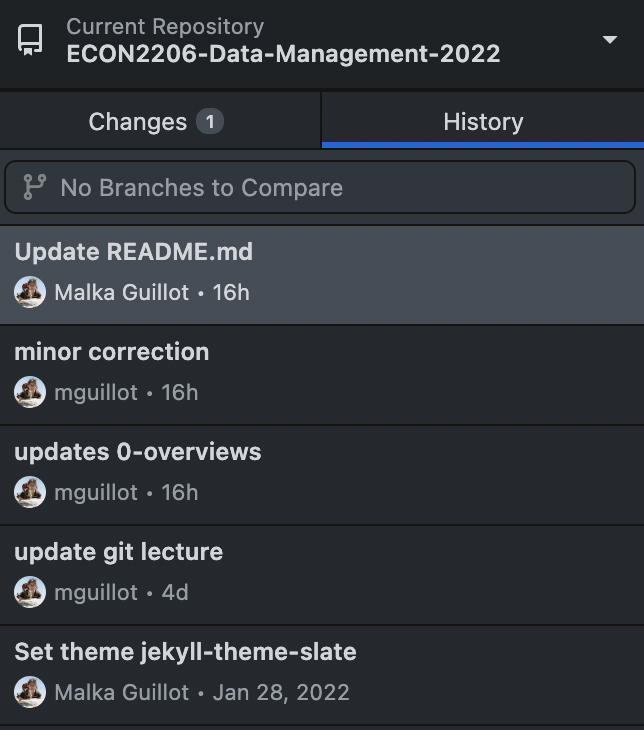

# Data Management
## GIT: A version control system
### [Malka Guillot](https://malkaguillot.github.io/)
### HEC Liège | <a href="https://gitlab.uliege.be/mguillot/econ2306-data-management-2021-22/">ECON2306</a>


---

<!-- .slide:  id="toc" class: left, inverse -->
# Table of contents

1. [The importance of version control ](#why)

2. [Git(Hub)](#git)
2. [Getting started on a project ](#start)
3. [Backbone of git: Commits & branches](#commit)
3. [The flesh of git: Collaborating](#colab)
3. [Epilogue](#epilogue)

<!--
Réfernce :

- lecture git (but with RStudio) => Grant Delmott
- Aniket : https://github.com/dlab-berkeley/Computational-Social-Science-Training-Program/blob/master/Reproducible%20Data%20Science/GitHub%20Intro.md
- slides : https://www.frankpinter.com/notes/git-for-economists-presentation.pdf
- markdown https://daringfireball.net/projects/markdown/
- teaching perspective https://happygitwithr.com/classroom-overview.html

For students:
- manuel git : https://happygitwithr.com/
- gitlab cheatsheet https://about.gitlab.com/images/press/git-cheat-sheet.pdf
- interactive tutorial https://gitimmersion.com/index.html
- interactive tutorial git branching https://learngitbranching.js.org/?locale=fr_FR

-->

Notes:
Throughout this course, we'll be using a platform called GitHub. GitHub is a popular code hosting platform. It has lots of features that make version control and collaboration easier.

---

<!-- .slide: id="why"  -->
# The importance of version control

<html><div style='float:left'></div><hr color='#EB811B' size=1px width=796px></html>

--

<!-- .slide: class="fragmented-lists" -->

## What is version control?

Version control is a way to keep track of changes to code, text, and documents. And data and outputs.

  - It gives you an organized revision history
  - It lets you experiment *without fear*
  - It lets you go back and forth between many different versions of the same file, and see a list of the differences
  -  It makes (the technical aspects of) collaboration a breeze
  -  It lets you and your collaborators work on different versions and then merge them

Notes:
Version control refers to the techniques for managing changes to software and code, and easily going back and forth between older and new versions of a code base. Getting familiar with GitHub and all of its tools can take some time, but the benefits for open science and streamlined collaboration are worth it.

--

## From local to distributed version control system
- <bcolor>Local</bcolor>: everything is on your computer


[$-$]() No collaboration

[$-$]() Not possible to retrieve files if the local machine crashes

--

## From local to distributed version control system
- <bcolor>Centralized</bcolor>:
  - all files on 1 server
  - many collaborators checkout files


[$+$]() Collaboration

[$-$]() Not possible to retrieve files if the central server crashes

Notes:
Each collaborator only have a working copy. Only the server has the full history.

--

## From local to distributed version control system
- <bcolor>Distributed</bcolor>:
  - one or more servers
  - many collaborators


[$+$]() Collaboration

[$+$]() Each user has their own repository and a working copy

Notes:
**CCL**: GitHub is a useful tool because it removes a lot of the obstacles that we usually face when we are collaborating with others.
- Instead of *saving multiple versions* of the same document, GitHub lets us iterate on the same document while recording how it has changed over time.
- Rather than sending collaborators *messily named documents*, everyone can work from the same GitHub repository.
- GitHub also has tools for *resolving editing conflicts* between collaborators and creating a clear workflow.


--

## Why bother?


Also [git vs. Dropbox from a researcher's perspective](https://michaelstepner.com/blog/git-vs-dropbox/)

Notes:
This type of version control, where you put dates or number of things is not efficient:
- very hard to (collectively) remember what caused the change of version
- even harder to keep track of the correction of a coding error (which versions are right)?
- Maybe you introduced a new mistake !  

--

## [CCL] Version control system

Enables <bcolor>coordinatation</bcolor> $\rightarrow$ no code change is lost or accidentally overwriten.

Provides an organized <bcolor>sharing</bcolor> platform $\rightarrow$ *open source* & documentation

$\Rightarrow$ key tool from our <bcolor>project management</bcolor> perspective

$\Rightarrow$ widely used in a companies / not enough in research:

- Software development
- Scientific researcher
- Anything involving coding (even latex)


Notes:
- [Central]() role of VC in global software development
- [Research]() : Git(Hub) helps to operationalize the ideals of **open science** and **reproducibility**.

---

<!-- .slide: id="git"  -->
# Git(Hub)
<html><div style='float:left'></div><hr color='#EB811B' size=1px width=796px></html>

--

## This is Git


Source: https://xkcd.com/1597/

--

## Git(Hub): a solution

- [Git](https://git-scm.com/):  
 <!-- .element: class="fragment" data-fragment-index="1" -->

  - Git is a <bcolor>distributed version control system</bcolor>. *(Wait, what?)*

  - *Okay, try this:* Imagine if Dropbox and the "Track changes" feature in MS Word had a baby. Git would be that baby.

  - most popular *open source* version control system out there.

  <!-- .element: class="fragment" data-fragment-index="1" -->

<!--
  *Even better* than that because Git is optimised for the things that economists and data scientists spend a lot of time working on (e.g. **code**).
-->

- [GitHub](https://github.com/)   <!-- .element: class="fragment" data-fragment-index="2" -->

  - GitHub = <bcolor>online hosting platform</bcolor> that provides an array of services built on top of the Git system. <!-- .element: class="fragment" data-fragment-index="2" -->
    - (Similar platforms include Bitbucket and GitLab.)

  <!-- .element: class="fragment" data-fragment-index="2" -->

--

## Git vs. Github

- It's important to realize that Git and GitHub are distinct things.

- We don't *need* GitHub to use Git... But it will make our lives so much easier.

$\rightarrow$ There is a learning curve, but I promise you it's worth it.

  <!-- .element: class="fragment" data-fragment-index="3" -->


Notes:
- **Git** helps to coordinate so that no code change is lost or accidentally overwriten.

- **Git** solves the version control problem, **GitHub** solves the code repository problem.


--

## Git model

1. You do work in your <bcolor>working directory</bcolor>
2. Then you add it to your <bcolor>staging area</bcolor>
2. Once you've staged [all you changes for one discrete task](), <bcolor>commit</bcolor> a snapshot of the staging area
3. If you have a remote repository, <bcolor>push your commit</bcolor>


---

<!-- .slide: id="start"  -->
# Getting started on a project

<html><div style='float:left'></div><hr color='#EB811B' size=1px width=796px></html>

Where we create our first repository!

--

## [Task 1] Setup [GitHub account](https://github.com/)

- Navigate to [GitHub's homepage](https://github.com/) + "Sign Up"
  - Go through the account setting steps ("Verify your email address"...)


Navigate to GitHub's homepage. Navigate to "Sign Up" in the top right hand side of the page.

--

## [Task 2] Getting started with Git(Hub)

1. Install [Git](https://git-scm.com/downloads) (Linux, Mac, Windows) if not already installed

2. Git comes with a command line interface (powerful!).

3. You might want to add a *graphical interface* to make things easier:
  - [GitHub desktop](https://desktop.github.com/)
  - You can link it with your GitHub account

--

## [Task 3]  Your first (local) repository
Let's look at an example using [GitHub desktop]()

1. Open GitHub Desktop and select `File/New repository`
3. Choose the name and the local directory to use
3. Start working in the directory, i.e.
  - Create some `.txt` file with some text
  - Commit it
  - Make a modification, and commit again: look at the changes!


--

## [Hint]  What actually is the Git repository?
- The Git local repository is associated with a particular directory
- Open the directory in your Git interface to see your options
- Git stores all its workings in that directory in a hidden subfolder called “.git”

**3 special options**:
- <bcolor>```README.md```</bcolor>: description of the directory
- <bcolor>.gitignore</bcolor>: what should be ignored by the tracking systel
- <bcolor>licence</bcolor> $\rightarrow$ open source?

--

## [Hint] What should I include?
1. At a minimum:
  - Code (.do, .py, .R, .m, .jl, and so on)
  - Text files (.txt)
  - LATEX documents (.tex)
2. I also recommend:
  - Raw .csv datasets, if small (<10 MB)
3. These are binary files, so you can’t see differences between versions. I recommend including them anyway.
  - PDF files
  - Word, Excel, PowerPoint files
4. Some people also include all datasets.
  - Note that GitHub doesn’t allow files larger than 100 MB, or projects with total size larger than 1 GB.

For datasets, look into Git Large File Storage.

--

## [Hint] What should I exclude?

In order to avoid driving your collaborators crazy, you must tell Git to ignore the junk files using a file called .gitignore. It looks like this:
- Junk created by LaTeX: $\textrm{*.synctex.gz, *.out *.log }$
- Junk created by Python:  $\textrm{*.pyc}$

**Best practice**: use .gitignore to explicitly exclude everything that you don’t want to include, and commit .gitignore like any other regular file.

GitHub maintains a list of standard .gitignore files for many common languages.


---

<!-- .slide: id="commit"  -->
# Backbone of git: Commits & branches
<html><div style='float:left'></div><hr color='#EB811B' size=1px width=796px></html>

Where we commit ourselves (locally)!

--

## Commits: saving a snapshot
"One discrete task" = a collection of changes, across multiple files (or not), that does *one thing*.

*Examples*:
- Change the formatting of a variable from string to numeric, and treat it properly across multiple scripts
- Change your regression specification in code, in the output, and in your paper and supporting documentation
- Add a new function

--

## Before you commit

- Your code should run properly $\rightarrow$ run tests
- No compilation erros (in Latex for example)
- Output should be consistent inside the commit (including comments)

But it’s better to have *frequent commits* (that might have small
mistakes) than to have *giant, infrequent* commits.

--

## Viewing changes when committing


--

## Commit message
Examples:
- “Change the formatting of start date variable from string to date format”
- “Add year dummies to regression specification”

$\rightarrow$ The more detail, the more your future self will thank you.

--

## Commit message: example


--

## Viewing commit history



Notes:
Github desktop shows you a list of past changes. You can also look at the commit content, and changes

--

## When things go wrong: go back in time
What happens when a commit was a mistake? <bcolor>Revert it</bcolor>, to make a new commit that undoes it.


--

## This can happen!


Source: https://xkcd.com/1296/

--

## Branches: trying things out
Branches are the most powerful part of Git

- By default, all the work you do goes into the “master” branch

- Want to experiment? Start a new branch
  - You can switch between branches, and make commits to
either branch

- If your experiment works out, commit and merge back into
the master branch
  - If there are conflicts between the commits you’ve made on the
two branches, Git will ask you to resolve them
  - This is easiest with a graphical interface like GitKraken
  - Only works with binary files
  - If your experiment doesn’t work out, delete the new branch painlessly

Notes:
Very useful for big projects, but I won't develop this: less central for using git at the introductory level.


Branches: use branching exercise sessions:
- You want to keep your <bcolor>master branch</bcolor> clean so that you can <bcolor>fetch</bcolor> my

--

## Keeping it local vs. using a remote repository
Git doesn’t require a remote repository. You can run it 100% on your computer, with no connection to an outside server.
- Useful if you have restrictions on your code (e.g. confidential health data)
- A remote repository helps
  - keep things backed up seamlessly,
  - collaborate with others
- You can push all your branches to the remote repository, or only some of them
- Big companies often have an internal git server

--

## Pusing to the remote directory


---

<!-- .slide: id="colab"  -->
# Collaborating
<html><div style='float:left'></div><hr color='#EB811B' size=1px width=796px></html>

Where we open ourselves to others and go remote!


--

## Interacting with the remote directory
The remote repository is on a server, and holds a record of your commits and branches

You push to the remote repository to save all your commits
- You pull from the remote repository to load all new commits
- Always commit before pushing or pulling
- If what you’re doing is an experiment, make a new branch to avoid any trouble for your coauthor
- If there are conflicts between your commits and your colleagues’s commits, Git will ask you to resolve them

--

## Basic workflow: push - pull


This is what happens between your computer (local) and your repository (remote).

--

## Create a remote repository


- Make sure you click the box to initialize it with a README
- gitignore $\rightarrow$ python template
- licence

--

## Create a remote repository


--

## Basic work: clone or fork ?

 

--

## Cloning a repo


--

## Git Challenge 1

- Create an example repository on your GitHub account.

- git clone this repository to your computer. Go to this directory.

- Create three files named file1.txt, file2.txt, and file3.txt in your local repository.

- Stage, commit, and push file1.txt to your remote repository. Refresh the URL on your GitHub page. Do you see your commit?

- Stage, commit, and push file2.txt and file3.txt to your remote repository as a single commit.

--

## Navigating GitHub
Example: our [course repository](https://github.com/malkaguillot/ECON2206-Data-Management-2022)


- <bcolor>Notification</bcolor>: Notify you when there are changes or conversations in the repo.
- <bcolor>Star</bcolor>: Add this repo to a list of repos that appear in your feed. Think of this as "favoriting" a repo.
- <bcolor>Fork</bcolor>: Make a copy of this repository in your own account.
$\rightarrow$ Useful if you are not directly involved with a project but want to build on top of someone else's code.


--

## Git challenge 2 (using GitHub desktop):

- Fork the [course repository](https://github.com/malkaguillot/ECON2206-Data-Management-2022)
- Change the **upstream repository**
  - *In repository settings*: change the "Primary remote repository" to my [repo HTTPS addres](https://github.com/malkaguillot/ECON2206-Data-Management-2022.git)
- Create a folder <bcolor>sandbox</bcolor>: this is were you are going to work!
- Open the .gitignore (you can create it still)
- add on a new line: <bcolor>sandbox/*</bcolor> : this will ignore the content of the sandbox when working with the remote => no conflict !
- create a toy file in the sandbox
- In the meantime,  I make a commit
- Then can you fetch my commit?

Note:
Simpler if the upstream repository is the one from the class (mine) and note yours : you can directly pull my changes into your folder


---

<!-- .slide: id="epilogue"  -->
# Epilogue
<html><div style='float:left'></div><hr color='#EB811B' size=1px width=796px></html>

--

## How to interact with the materials?

   - Set up GitHub
   - Fork the class repository (-> your remote repository)
   - Clone your repository on your computer (-> your local repository)
   - Add an upstream origin (mine)
   - Work in the *sandbox* folder
    - this way, you can fetch my updates


--

## References
- Extensive git manual: https://happygitwithr.com/
- [git - the simple guide](https://rogerdudler.github.io/git-guide/)
- gitlab cheatsheet https://about.gitlab.com/images/press/git-cheat-sheet.pdf
- interactive tutorial https://gitimmersion.com/index.html
- interactive tutorial on git branching https://learngitbranching.js.org/?locale=fr_FR
- In case it goes wrong: http://ohshitgit.com/
